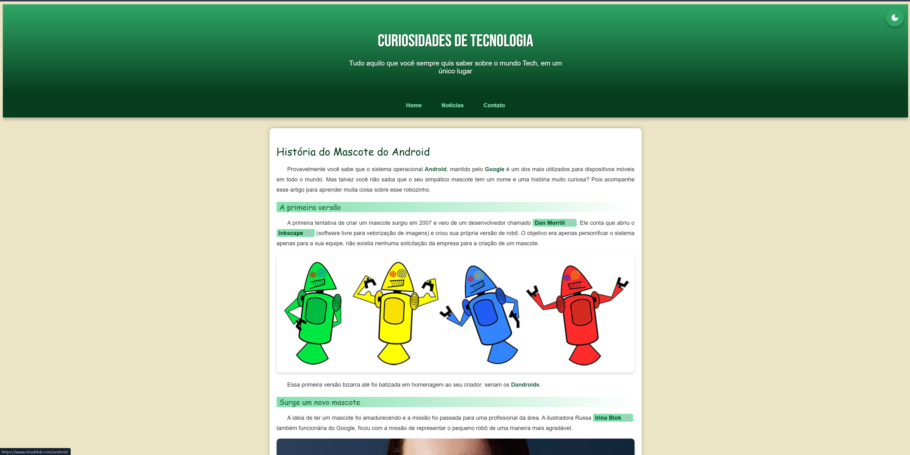

# 🟢 Curiosidades de Tecnologia - Mascote do Android

Este projeto é uma página web interativa criada com foco em HTML, CSS e JavaScript, com o objetivo de explorar de forma didática a origem do mascote do sistema Android e suas versões ao longo da história.

## ✨ Funcionalidades

- ✅ Design responsivo e moderno
- 🌗 Modo claro/escuro com botão flutuante
- 🕹️ Linha do tempo horizontal interativa das versões do Android
- ⬆️ Botão de voltar ao topo com animação
- 🧠 Curiosidades sobre o mascote e nomes das versões
- 🎨 Personalização visual baseada nas cores do Android

## 🚀 Melhorias implementadas (Pós Curso)

- ✅ **Modo escuro** com botão flutuante e animação
- ✅ **Linha do tempo horizontal animada** com rolagem suave
- ✅ **Scroll progressivo** com botão "Voltar ao topo"
- ✅ **Responsividade total** em diferentes dispositivos
- ✅ **Uso de variáveis CSS** para personalização e manutenção
- ✅ **Dark mode acessível** com classes dinâmicas e transições suaves
- ✅ **Separação de estilos e scripts externos**
- ✅ **Estilo da barra de rolagem personalizado**
- ✅ **Ajustes de acessibilidade e semântica**

## 🛠️ Tecnologias utilizadas

- HTML5
- CSS3 (com variáveis, grid/flex, dark mode)
- JavaScript (scroll suave, toggle de tema, eventos)
- Google Fonts & Material Icons

## 🎯 Objetivo

Este projeto foi desenvolvido como exercício de aprimoramento de front-end, focando em boas práticas de organização de código, responsividade e interatividade com o usuário.

## 📸 Print da Tela

## 👨‍💻 Desenvolvedor

[Wanderson Vitor](https://github.com/wvitu)  

> 💼 Projeto finalizado com foco em melhoria contínua, boas práticas de código e atenção à experiência do usuário. Feedbacks são bem-vindos!
